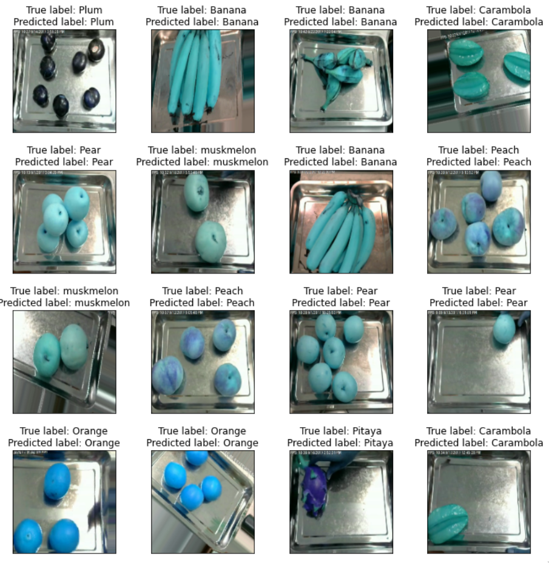

[![Contributors][contributors-shield]][contributors-url]
[![Forks][forks-shield]][forks-url]
[![Stargazers][stars-shield]][stars-url]
[![Issues][issues-shield]][issues-url]
[![LinkedIn][linkedin-shield]][linkedin-url]


<!-- PROJECT LOGO -->

<br />
<p align="center">
  <h3 align="center">Fruit classification</h3>

  <p align="center">
    A project made for my computational intelligence course.
    <br />
    <a href="https://github.com/KacperKurz/Fruit-classification---neural-networks"><strong>Explore the docs »</strong></a>
    <br />
    <br />
    <a href="https://github.com/KacperKurz/Fruit-classification---neural-networks/issues">Report Bug</a>
    ·
    <a href="https://github.com/KacperKurz/Fruit-classification---neural-networks/issues">Request Feature</a>
  </p>
</p>


<!-- TABLE OF CONTENTS -->
<details open="open">
  <summary><h2 style="display: inline-block">Table of Contents</h2></summary>
  <ol>
    <li>
      <a href="#about-the-project">About The Project</a>
      <ul>
        <li><a href="#built-with">Built With</a></li>
      </ul>
    </li>
    <li>
      <a href="#getting-started">Getting Started</a>
      <ul>
        <li><a href="#prerequisites">Prerequisites</a></li>
        <li><a href="#installation">Installation</a></li>
      </ul>
    </li>
    <li><a href="#usage">Usage</a></li>
    <li><a href="#contact">Contact</a></li>
    <li><a href="#acknowledgements">Acknowledgements</a></li>
  </ol>
</details>


<!-- ABOUT THE PROJECT -->
## About The Project



A neural network project I created for my computational intelligence course. Over 27 000 images were used for training and testing.
The result is a model which is 98.9% accurate.

More info can be found inside the jupyter notebook.


### Built With

* [Keras](https://keras.io/)


<!-- GETTING STARTED -->
## Getting Started

To get a local copy up and running follow these simple steps.

### Prerequisites

Make sure You have Keras and installed.
  ```sh
  pip install keras
  ```

### Installation

1. Clone the repo
   ```sh
   git clone https://github.com/KacperKurz/Fruit-classification---neural-networks.git
   ```


<!-- USAGE EXAMPLES -->
## Usage

```python
import keras
model = keras.models.load_model('path/to/h5File')
```


<!-- CONTACT -->
## Contact

Kacper Kurz - kacperkurz@protonmail.com

Project Link: [https://github.com/KacperKurz/Fruit-classification---neural-networks](https://github.com/KacperKurz/Fruit-classification---neural-networks)


<!-- ACKNOWLEDGEMENTS -->
## Acknowledgements

* [Kaggle](https://www.kaggle.com/)


<!-- MARKDOWN LINKS & IMAGES -->
<!-- https://www.markdownguide.org/basic-syntax/#reference-style-links -->
[contributors-shield]: https://img.shields.io/github/contributors/KacperKurz/repo.svg?style=for-the-badge
[contributors-url]: https://github.com/KacperKurz/repo/graphs/contributors
[forks-shield]: https://img.shields.io/github/forks/KacperKurz/repo.svg?style=for-the-badge
[forks-url]: https://github.com/KacperKurz/repo/network/members
[stars-shield]: https://img.shields.io/github/stars/KacperKurz/repo.svg?style=for-the-badge
[stars-url]: https://github.com/KacperKurz/repo/stargazers
[issues-shield]: https://img.shields.io/github/issues/KacperKurz/repo.svg?style=for-the-badge
[issues-url]: https://github.com/KacperKurz/repo/issues
[linkedin-shield]: https://img.shields.io/badge/-LinkedIn-black.svg?style=for-the-badge&logo=linkedin&colorB=555
[linkedin-url]: https://linkedin.com/in/kacper-kurz-175707199
